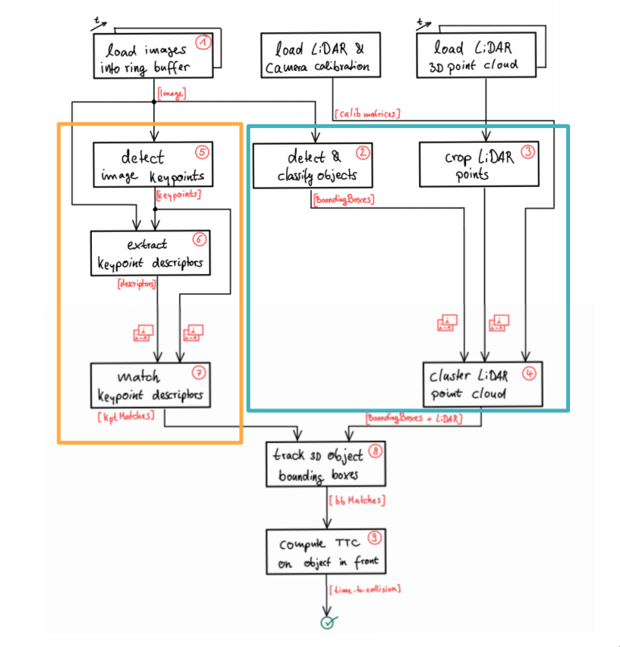

# Object Tracking in 3D Space

This project builds on components already implemented in the [Camera-Based 2D Feature Tracking](https://cmake.org/install/) repo. These include:

* Object detection using the YOLO deep-learning framework
* Keypoint detectors and descriptors for feature tracking
* Useful data structures for storing lidar and camera sensor data to optimize memory load

These are described in the program schematic below in the _orange_ box.

The missing parts in the schematic are implemented by completing the following three major tasks:

1. Develop a way to match 3D objects over time by using keypoint correspondences.
2. Compute the Time-To-Collission (TTC) based on Lidar measurements.
3. Do the same using the camera which requires to first associate keypoint matches to regions of interest and then to compute the TTC based on those matches.

## Dependencies for Running Locally

* cmake >= 2.8
  * All OSes: [click here for installation instructions](https://cmake.org/install/)
* make >= 4.1 (Linux, Mac), 3.81 (Windows)
  * Linux: make is installed by default on most Linux distros
  * Mac: [install Xcode command line tools to get make](https://developer.apple.com/xcode/features/)
  * Windows: [Click here for installation instructions](http://gnuwin32.sourceforge.net/packages/make.htm)
* OpenCV >= 4.1
  * This must be compiled from source using the `-D OPENCV_ENABLE_NONFREE=ON` cmake flag for testing the SIFT and SURF detectors.
  * The OpenCV 4.1.0 source code can be found [here](https://github.com/opencv/opencv/tree/4.1.0)
* gcc/g++ >= 5.4
  * Linux: gcc / g++ is installed by default on most Linux distros
  * Mac: same deal as make - [install Xcode command line tools](https://developer.apple.com/xcode/features/)
  * Windows: recommend using [MinGW](http://www.mingw.org/)

## Basic Build Instructions

1. Clone this repo.
2. Make a build directory in the top level project directory: `mkdir build && cd build`
3. Compile: `cmake .. && make`
4. Run it: `./3D_object_tracking`.
